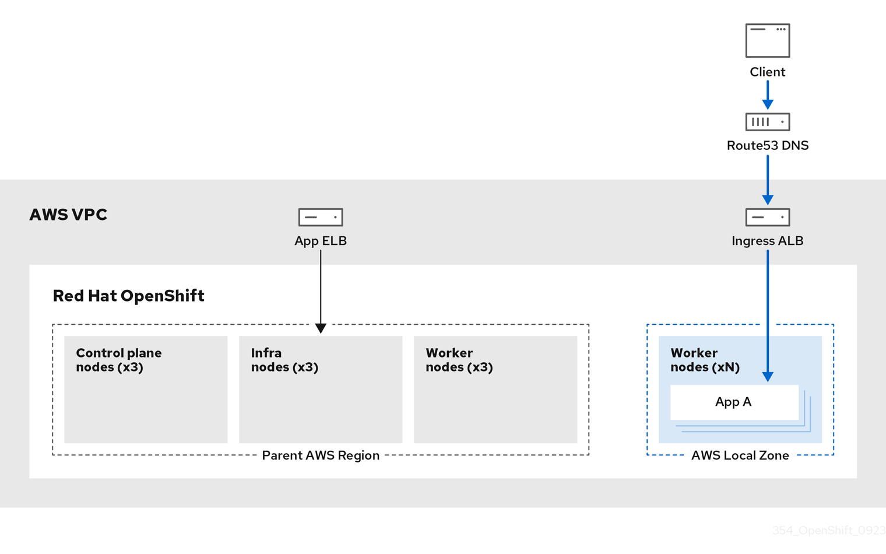

// Module included in the following assemblies:
//
// * architecture/rosa-architecture-models.adoc
:_mod-docs-content-type: REFERENCE
[id="rosa-architecture-local-zones_{context}"]
= ROSA architecture with Local Zones

ROSA supports the use of AWS Local Zones, which are metropolis-centralized availability zones where customers can place latency-sensitive application workloads within a VPC. Local Zones are extensions of AWS Regions and are not enabled by default. When Local Zones are enabled and configured, the traffic is extended into the Local Zones for greater flexibility and lower latency. For more information, see "Configuring machine pools in Local Zones".

The following diagram displays a ROSA cluster without traffic routed into a Local Zone.

.ROSA cluster without traffic routed into Local Zones
image::../images/354_OpenShift_ROSA_Local_Zones_0923_1.png[ROSA cluster without traffic routed into Local Zones]

The following diagram displays a ROSA cluster with traffic routed into a Local Zone.

.ROSA cluster with traffic routed into Local Zones

