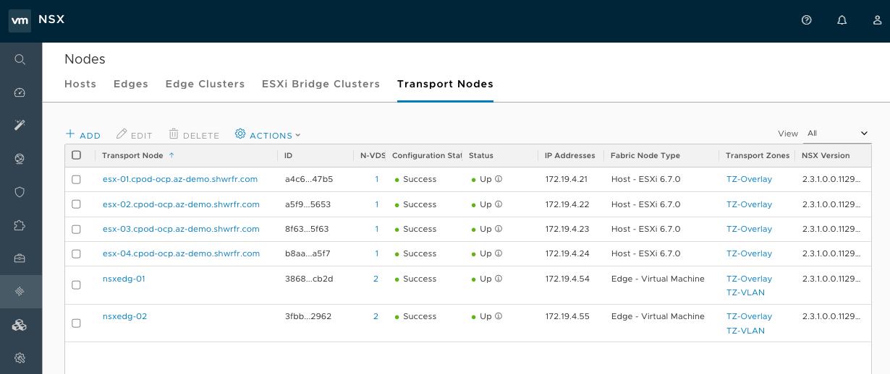
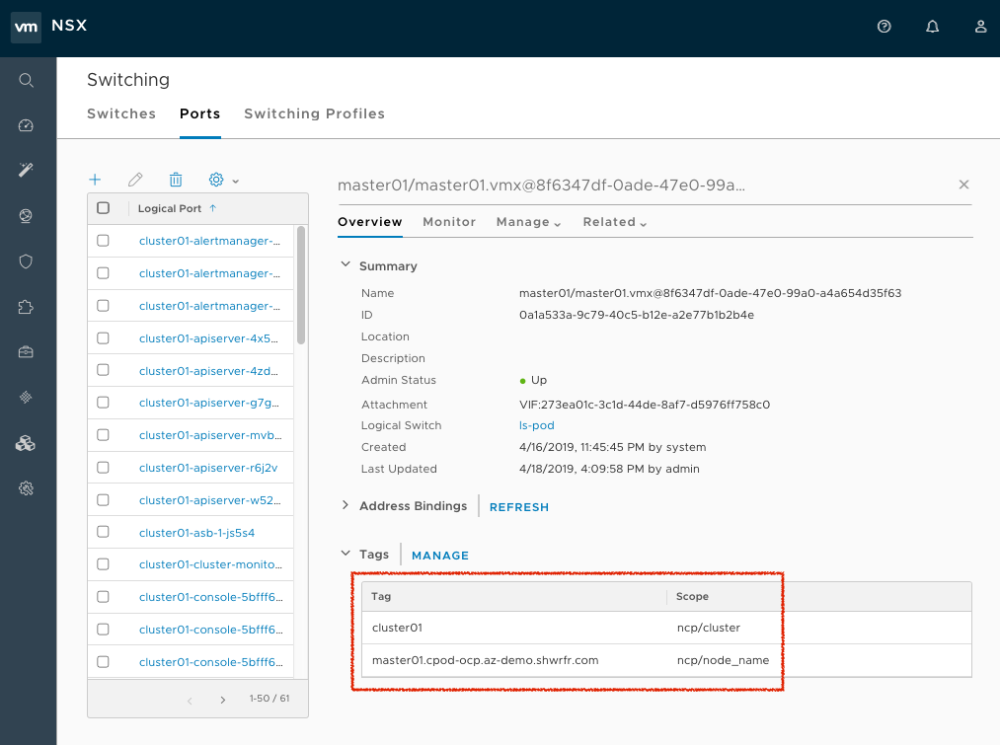
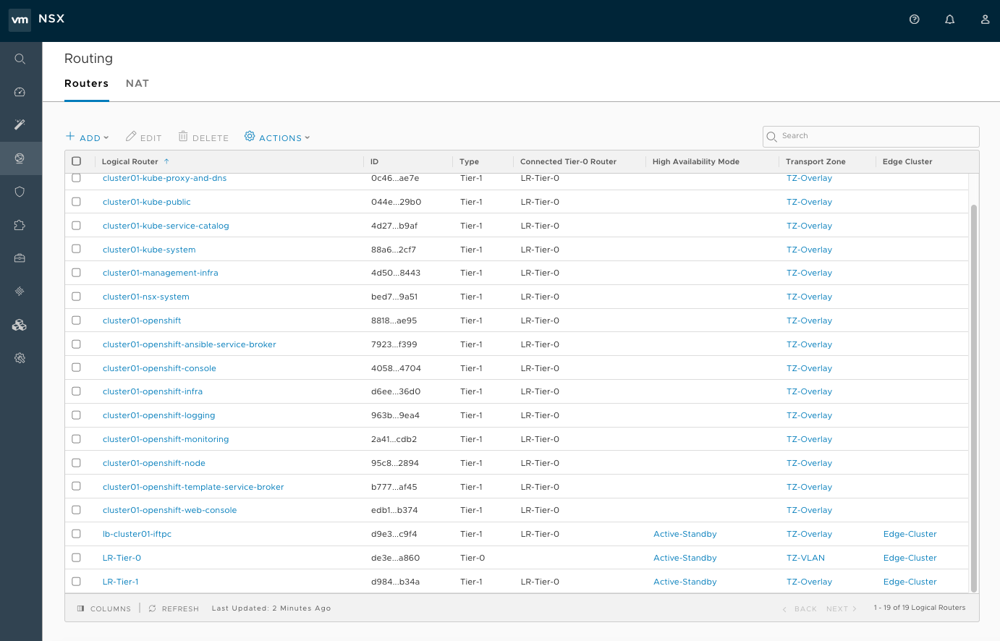
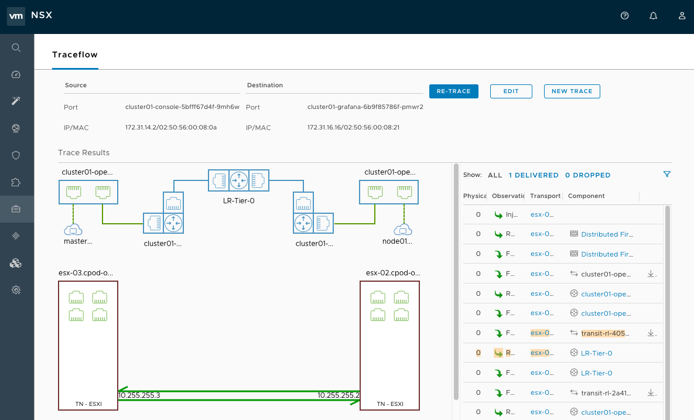
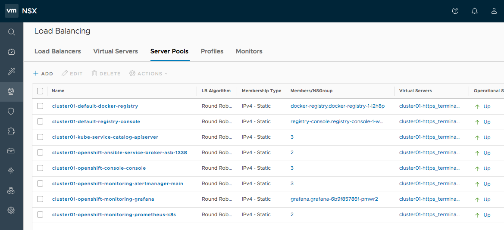

[[install-config-configuring-nsx-t-sdn]]
[%hardbreaks]
= Configuring NSX-T SDN
{product-author}
{product-version}
:data-uri:
:icons:
:experimental:
:toc: macro
:toc-title:

toc::[]

[[nsx-t-sdn-and-openshift]]
== NSX-T SDN and {product-title}

VMware NSX-T provides advanced software-defined networking (SDN), security and visibility
to container environments that simplifies IT operations and extends {product-title}’s native
networking capabilities.

NSX-T supports Virtual Machine, Bare-metal, and container workloads across multiple clusters. This allows
organisations to have complete visibility using a single SDN across the entire environment.

See xref:../architecture/networking/network_plugins.adoc#nsx-sdn[Networking]
for more information on how NSX-T is integrated with {product-title}.

[[nsx-t-sdn-operations-workflow]]
== Example Topology

There is a *T0 router* on the top that connects physical with virtual world. We also have *T1 router* acting as a default gateway for the OpenShift VMs.

Those VMs have *two vNICs* each. One vNIC is connected to Management Logical Switch for accessing the VMs. The second vNIC is connected to a dump Logical Switch and is used by nsx-node-agent to uplink the POD networking. For further details, we strongly suggest reading the link:https://docs.vmware.com/en/VMware-NSX-T-Data-Center/2.3/nsxt_23_ncp_OpenShift.pdf[NSX Container Plug-in for OpenShift].

The LoadBalancer used for configuring OpenShift Routes plus all project’s *T1 routers* and *Logical Switches* are created automatically later when we install OpenShift. In this topology we use the default OpenShift HAProxy Router for all infrastructure components such as Grafana, Prometheus, Console, Service Catalog and others.

This means that the DNS records for the infra components need to point the infrastructure node IP addresses since the HAProxy uses the host network namespace.
This works well for infra routes but in order to avoid exposing the infra nodes management IPs to the outside world we will be deploying application specific routes to the NSX-T LoadBalancer.

The topology here assumes 3 x OpenShift master virtual machines and 4 x OpenShift worker virtual machines(two for infrastructure and two for compute).

[[nsx-t-sdn-installation]]
== Installation

Prerequisites:

* ESXi hosts requirements:
** ESXi servers that host {product-title} node VMs must be NSX-T Transport Nodes.

Example of High-Available environment: +

* DNS requirements:
** *You must add* to your DNS server a new entry with a wildcard to the 'infra' nodes, this allows load balancing by NSX-T or other third-party LB. In the 'hosts' file below, it's defined by 'openshift_master_default_subdomain' variable.
** You have also to update your DNS server accordingly with: 'openshift_master_cluster_hostname' & 'openshift_master_cluster_public_hostname' variables.

* Virtual Machine requirements:
** {product-title} node VMs must have *two vNICs*:
** Management vNIC connected to the *Logical Switch* that is uplinked to the management *T1 router*.
** The second vNIC on all VMs needs to have two Tags in *NSX-T* in order 'nsx-container-plugin' (NCP) to know which port needs to be used as a parent VIF for all PODs running in the particular OpenShift node. Tags need to be as following:

----
{'ncp/node_name': 'node_name'}
{'ncp/cluster': 'cluster_name'}
----

You should set and see tags for all nodes like this. For large scale, it's possible to automate this by API Call or through Ansible: +

* The order in the UI is reverse than in the API.
The 'node_name' must be exactly as kubelet will see it and the cluster name must be the same as specified as 'nsx_openshift_cluster_name' in the ansible hosts file shown below. We need to make sure that the proper *tags are applied on the second vNIC on every node*.

* NSX-T requirements. The following objects need to be pre-created in NSX in order later to be referred in the ansible hosts file:
1. T0 Router
2. Overlay Transport Zone
3. IP Block for POD networking
4. IP Block for routed(NoNAT) POD networking – optional
5. IP Pool for SNAT – by default the subnet given per Project from the IP Block in point 3 is routable only inside NSX-T. NCP uses this IP Pool in order to provide connectivity to the outside.
6. Top and Bottom FW sections (optional) in dFW (Distributed Firewall). NCP will be placing k8s Network Policy rules between those two sections.
7. Open vSwitch and CNI plugin RPMs need to be hosted *on a HTTP server reachable from the {product-title} Node VMs* (http://websrv.example.com in this example). Those files are included in NCP tar file that you should download from link:https://my.vmware.com/web/vmware/details?downloadGroup=NSX-T-PKS-240&productId=673[my.vmware.com].

In the Ansible 'hosts' file, the following parameters need to be specified in
order to setup NSX-T as the network plug-in:

----
[OSEv3:children]
masters
nodes
etcd

[OSEv3:vars]
ansible_ssh_user=root
openshift_deployment_type=origin
openshift_master_identity_providers=[{'name': 'htpasswd_auth', 'login': 'true', 'challenge': 'true', 'kind': 'HTPasswdPasswordIdentityProvider'}]
openshift_master_htpasswd_users={"admin" : "$apr1$H0QeP6oX$HHdscz5gqMdtTcT5eoCJ20"}
openshift_master_default_subdomain=demo.example.com
openshift_use_nsx=true
os_sdn_network_plugin_name=cni
openshift_use_OpenShift_sdn=false
openshift_node_sdn_mtu=1500
openshift_master_cluster_method=native
openshift_master_cluster_hostname=master01.example.com
openshift_master_cluster_public_hostname=master01.example.com
openshift_hosted_manage_registry=true
openshift_hosted_manage_router=true
openshift_enable_service_catalog=true
openshift_cluster_monitoring_operator_install=true
openshift_web_console_install=true
openshift_console_install=true

# NSX-T specific configuration
#nsx_use_loadbalancer=false
nsx_openshift_cluster_name='cluster01'
nsx_api_managers='nsxmgr.example.com'
nsx_api_user='nsx_admin'
nsx_api_password='nsx_api_password_example'
nsx_tier0_router='LR-Tier-0'
nsx_overlay_transport_zone='TZ-Overlay'
nsx_container_ip_block='pod-networking'
nsx_no_snat_ip_block='pod-nonat'
nsx_external_ip_pool='pod-external'
nsx_top_fw_section='containers-top'
nsx_bottom_fw_section='containers-bottom'
nsx_ovs_uplink_port='ens224'
nsx_cni_url='http://websrv.example.com/nsx-cni-buildversion.x86_64.rpm'
nsx_ovs_url='http://websrv.example.com/openvswitch-buildversion.rhel75-1.x86_64.rpm'
nsx_kmod_ovs_url='http://websrv.example.com/kmod-openvswitch-buildversion.rhel75-1.el7.x86_64.rpm'
nsx_insecure_ssl=true

# vSphere Cloud Provider
#openshift_cloudprovider_kind=vsphere
#openshift_cloudprovider_vsphere_username='administrator@example.com'
#openshift_cloudprovider_vsphere_password='viadmin_password'
#openshift_cloudprovider_vsphere_host='vcsa.example.com'
#openshift_cloudprovider_vsphere_datacenter='Example-Datacenter'
#openshift_cloudprovider_vsphere_cluster='example-Cluster'
#openshift_cloudprovider_vsphere_resource_pool='ocp'
#openshift_cloudprovider_vsphere_datastore='example-Datastore-name'
#openshift_cloudprovider_vsphere_folder='ocp'

[masters]
master01.example.com
master02.example.com
master03.example.com

[etcd]
master01.example.com
master02.example.com
master03.example.com

[nodes]
master01.example.com ansible_ssh_host=192.168.220.2 OpenShift_node_group_name='node-config-master' OpenShift_ip=192.168.220.2
master02.example.com ansible_ssh_host=192.168.220.3 OpenShift_node_group_name='node-config-master' OpenShift_ip=192.168.220.3
master03.example.com ansible_ssh_host=192.168.220.4 OpenShift_node_group_name='node-config-master' OpenShift_ip=192.168.220.4
node01.example.com ansible_ssh_host=192.168.220.5 OpenShift_node_group_name='node-config-infra' OpenShift_ip=192.168.220.5
#node02.example.com ansible_ssh_host=192.168.220.6 OpenShift_node_group_name='node-config-infra' OpenShift_ip=192.168.220.6
node03.example.com ansible_ssh_host=192.168.220.7 OpenShift_node_group_name='node-config-compute' OpenShift_ip=192.168.220.7
node04.example.com ansible_ssh_host=192.168.220.8 OpenShift_node_group_name='node-config-compute' OpenShift_ip=192.168.220.8
----

Check prerequisites for {product-title} with NSX-T CNI:
----
$ ansible-playbook -i hosts openshift-ansible/playbooks/prerequisites.yml
----

Once the above playbook has executed successfully, run the following on all nodes:

Assuming NCP Container image is downloaded locally on all nodes.
----
$ docker load -i nsx-ncp-rhel-xxx.tar
----

Get the image name and retag it:
----
$ docker images
$ docker image tag registry.local/xxxxx/nsx-ncp-rhel nsx-ncp
----

Last step is to deploy the {product-title} cluster:
----
$ ansible-playbook -i hosts openshift-ansible/playbooks/deploy_cluster.yml
----

Once it is complete validate that the NCP and nsx-node-agent PODs are running:
----
$ oc get pods -o wide -n nsx-system
NAME                   READY     STATUS    RESTARTS   AGE       IP              NODE                                   NOMINATED NODE
nsx-ncp-5sggt          1/1       Running   0          1h        192.168.220.8   node04.example.com     <none>
nsx-node-agent-b8nkm   2/2       Running   0          1h        192.168.220.5   node01.example.com     <none>
nsx-node-agent-cldks   2/2       Running   0          2h        192.168.220.8   node04.example.com     <none>
nsx-node-agent-m2p5l   2/2       Running   28         3h        192.168.220.4   master03.example.com   <none>
nsx-node-agent-pcfd5   2/2       Running   0          1h        192.168.220.7   node03.example.com     <none>
nsx-node-agent-ptwnq   2/2       Running   26         3h        192.168.220.2   master01.example.com   <none>
nsx-node-agent-xgh5q   2/2       Running   26         3h        192.168.220.3   master02.example.com   <none>
----

== Check NSX-T after {product-title} deployement

Check routing. T1 routers has been created during namespace creation and linked to T0 router:

Observe Network Traceflow and visibility, for example between 'console' and 'grafana'. +
To help fully understand, secure and optimise communications between pods, projects, virtual machines and external services: +

Check Load Balancing. NSX-T offers Load Balancer and Ingress Controller capabilities:

For additional configuration and options please refer to the link:https://docs.vmware.com/en/VMware-NSX-T-Data-Center/2.4/rn/NSX-Container-Plugin-Release-Notes.html[VMware NSX-T v2.4 OpenShift Plug-In] documentation. 
