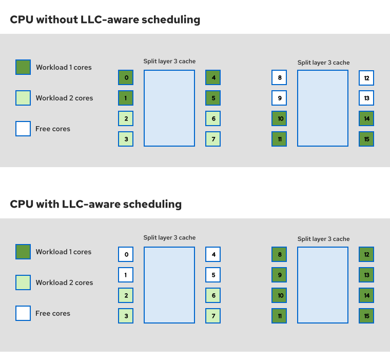

// Module included in the following assemblies:
//
// * scalability_and_performance/cnf-tuning-low-latency-nodes-with-perf-profile.adoc

:_mod-docs-content-type: PROCEDURE
[id="cnf-configuring-llc-aware-cpu-pinning_{context}"]
= Configuring LLC-aware CPU pinning for low latency workloads

Traditional CPU architectures feature a single last-level cache (LLC), or layer 3 cache, which all cores on the CPU can use. Some modern CPU architectures split this LLC into two or more physical caches to reduce the distance, and therefore latency, between the cores and the LLC. The term LLC domain refers to cores that share the same LLC.

To take advantage of this split LLC architecture, you can configure a CPU Manager policy to pin workloads to cores in the same LLC domain. This configuration can significantly improve performance for low latency workloads. In split LLC architecture CPUs, this approach also reduces noisy neighbor conditions and inter-cache contention issues that might otherwise occur without LLC-aware scheduling.

The following diagram shows how the CPU Manager can use LLC-aware scheduling to pin workloads to cores in the same LLC domain. The diagram is for illustrative purposes only and does not necessarily reflect actual scheduling behavior.

.Example LLC-aware CPU pinning

You can configure the `prefer-align-cpus-by-uncorecache` CPU Manager option in the `KubeletConfig` resource to enable LLC-aware pinning. This feature uses a best-effort approach, for example:

* Guaranteed containers larger than a LLC domain are still admitted.
* If the CPU Manager cannot find a suitable core, the CPU Manager admits the pod to the cluster without LLC-aware pinning.

[NOTE]
====
You must set `cpuManagerPolicy: static` to use LLC-aware CPU pinning.
====

.Prerequisites

* You have `cluster-admin` role access.
* You installed the {oc-first}.
* The target machine has a CPU architecture with a split LLC cache.

.Procedure

. Label the target node that you want to configure by running the following command:
+
[source,terminal]
----
$ oc label node <node_name> node-role.kubernetes.io/worker-cnf="" <1>
----
<1> Replace `<node_name>` with the name of your node. This example applies the `worker-cnf` label.

. Optional: Create a `MachineConfigPool` resource containing the target nodes:
+
[NOTE]
====
You can use an existing machine config pool that contains the target nodes, or create a new pool with the target nodes. 
This example demonstrates creating a new machine config pool named `worker-cnf`.
====

.. Create a YAML file that defines the `MachineConfigPool` resource:
+
.Example `mcp-worker-cnf.yaml` file
[source,yaml]
----
apiVersion: machineconfiguration.openshift.io/v1
kind: MachineConfigPool
metadata:
  name: worker-cnf <1>
  labels:
    machineconfiguration.openshift.io/role: worker-cnf <2>
spec:
  machineConfigSelector:
    matchExpressions:
      - {
           key: machineconfiguration.openshift.io/role,
           operator: In,
           values: [worker, worker-cnf],
        }
  paused: false
  nodeSelector:
    matchLabels:
      node-role.kubernetes.io/worker-cnf: "" <3>
----
<1> Specify a name for the `MachineConfigPool` resource.
<2> Specify a unique label for the machine config pool.
<3> Specify the nodes with the target label that you defined.

.. Apply the `MachineConfigPool` resource by running the following command:
+
[source,terminal]
----
$ oc apply -f mcp-worker-cnf.yaml
----
+
.Example output
[source,terminal]
----
machineconfigpool.machineconfiguration.openshift.io/worker-cnf created
----

. Create a `openshift-llc-alignment` file in the `/etc/kubernetes/` directory to enable the feature:

.. Create a YAML file that defines a `MachineConfig` resource to create the `openshift-llc-alignment` file:
+
.Example `mc-enablement.yaml` file
[source,yaml]
----
apiVersion: machineconfiguration.openshift.io/v1
kind: MachineConfig
metadata:
  name: 99-worker-openshift-llc-alignment
  labels:
    machineconfiguration.openshift.io/role: worker-cnf <1>
    node-role.kubernetes.io/worker-cnf: "" <2>
spec:
  config:
    ignition:
      version: 3.2.0
    storage:
      files:
        - path: /etc/kubernetes/openshift-llc-alignment <3>
          mode: 0644
          overwrite: true
          contents:
            source: data:, <4>
----
<1> Selects a node in the `worker-cnf` machine config pool.
<2> Specifies the node with the `worker-cnf` label.
<3> Creates the `openshift-llc-alignment` file in the `/etc/kubernetes/` directory.
<4> This example uses an empty file. The contents of the file does not matter. The feature is enabled when you create the `openshift-llc-alignment` file in the `/etc/kubernetes/` directory.
+
[NOTE]
====
The node restarts after you apply the `MachineConfig` resource.
====

.. Apply the `MachineConfig` resource by running the following command:
+
[source,terminal]
----
$ oc apply -f mc-enablement.yaml
----
+
.Example output
[source,terminal]
----
machineconfig.machineconfiguration.openshift.io/99-worker-openshift-llc-alignment created
----

. Create a `KubeletConfig` resource to configure the `prefer-align-cpus-by-uncorecache` option:

.. Create a YAML file that defines a `KubeletConfig` resource:
+
.Example `kc-llc-aware.yaml` file
[source,yaml]
----
apiVersion: machineconfiguration.openshift.io/v1
kind: KubeletConfig
metadata:
  name: llc-aware-kubeletconfig
spec:
  machineConfigPoolSelector:
    matchLabels:
      machineconfiguration.openshift.io/role: worker-cnf <1> 
  kubeletConfig:
    cpuManagerPolicy: "static" <2>
    cpuManagerPolicyOptions:
        prefer-align-cpus-by-uncorecache: "true" <3>
#...
----
<1> Selects the nodes in the `worker-cnf` machine config pool.
<2> Sets the `cpuManagerPolicy` to `static`.
<3> Enables the `prefer-align-cpus-by-uncorecache` option for LLC-aware scheduling by the CPU Manager.
+
[NOTE]
====
The node restarts after you apply the `KubeletConfig` resource.
====

.. Apply the `KubeletConfig` resource by running the following command:
+
[source,terminal]
----
$ oc apply -f kc-llc-aware.yaml
----
+
.Example output
[source,terminal]
----
machineconfig.machineconfiguration.openshift.io/99-worker-openshift-llc-alignment created
----

.Verification

. Check that the enablement file was created on the target node by running the following command:
+
[source,terminal]
----
$ oc debug node/<node_name> <1>
----
<1> Replace `<node_name>` with the name of your node.

. Use the `stat` command to check for the `openshift-llc-alignment` file by running the following commands:
+
[source,terminal]
----
sh-5.1# chroot /host
sh-5.1# stat /etc/kubernetes/openshift-llc-alignment
----
+
.Example output
[source,terminal]
----
  File: /etc/kubernetes/openshift-llc-alignment
  Size: 0         	Blocks: 0          IO Block: 4096   regular empty file
...
----

. Create a `Pod` resource to test the configuration:

.. Create a YAML file that defines a `Pod` resource:
+
.Example `pod-llc-aware.yaml` file
[source,yaml]
----
apiVersion: v1
kind: Pod
metadata:
  name: llc-aware-pod
spec:
  containers:
  - name: centos-container
    image: quay.io/centos/centos:stream9 <1>
    command: ["/bin/bash", "-c", "sleep infinity"]
    resources:
      limits:
        cpu: "8" <2>
        memory: "100Mi"
      requests:
        cpu: "8" <3>
        memory: "100Mi"
  nodeSelector:
    node-role.kubernetes.io/worker-cnf: "" <4>
----
<1> This example uses a CentOS image to test the configuration.
<2> The `cpu` field specifies the number of CPU cores to use.
<3> The `requests` field specifies the number of CPU cores to request. 
<4> The `nodeSelector` field selects the node with the `worker-cnf` label.

.. Apply the `Pod` resource by running the following command:
+
[source,terminal]
----
$ oc apply -f pod-llc-aware.yaml
----
+
.Example output
[source,terminal]
----
pod/llc-aware-pod created
----

. Remotely enter the container from the command line to check the CPU assignment by running the following command:
+
[source,terminal]
----
$ oc exec -it llc-aware-pod --container centos-container -- /bin/bash
----
+
[source,terminal]
----
bash-5.1# cat /sys/fs/cgroup/cpuset.cpus
----
+
.Example output
[source,terminal]
----
0,1,2,3,4,5,6,7
----
+
The output shows the CPU cores assigned to the container.

. Verify that the assigned cores share the same LLC by running the following command:
+
[source,terminal]
----
$ cat /sys/devices/system/cpu/cpu3/cache/index3/shared_cpu_list
----
* This example uses `cpu3`, which checks the LLC affinity for the core with ID `3`.
* `index3` is the LLC cache index.
* `shared_cpu_list` shows the cores that share the LLC with the specified core.
+
.Example output
[source,terminal]
----
0-7
----
+
In this example, the output shows that core `3` shares the LLC with cores 0 to 7. Using this approach, you can verify that the CPU Manager is scheduling cores according to the LLC cache architecture.
