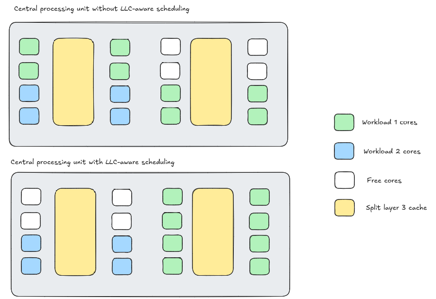

// Module included in the following assemblies:
//
// * scalability_and_performance/cnf-tuning-low-latency-nodes-with-perf-profile.adoc

:_mod-docs-content-type: PROCEDURE
[id="cnf-configuring-llc-aware-cpu-pinning_{context}"]
= Configuring LLC-aware CPU pinning for low latency workloads

Traditional CPU architectures feature a single last-level cache (LLC), or layer 3 cache, which all cores on the CPU can use. Some modern CPU architectures split this LLC into two or more physical caches to reduce the distance, and therefore latency, between the cores and the LLC.

To take advantage of this split LLC architecture, you can configure a CPU Manager policy to pin workloads to cores that have the lowest latency to the LLC. This configuration can significantly improve performance for low latency workloads. In split LLC architecture CPUs, this approach also reduces noisy neighbor conditions and inter-cache contention issues that might otherwise occur without LLC-aware scheduling.

.LLC-aware CPU pinning

You can configure the `prefer-align-cpus-by-uncorecache` CPU Manager option in the `KubletConfig` resource to enable LLC-aware pinning. This feature uses a best-effort approach, for example:

* Guaranteed containers larger than a LLC domain are still admitted.
* If the CPU Manager cannot find a suitable core, the CPU Manager admits the pod to the cluster without LLC-aware pinning.

[NOTE]
====
You must set `cpuManagerPolicy: static` to use LLC-aware CPU pinning.
====

.Prerequisites

* You have `cluster-admin` role access.
* You installed the OpenShift CLI (`oc`).
* The target machine has a CPU architecture with a split LLC cache.

.Procedure

. Label the target node that you want to configure by running the following command:
+
[source,terminal]
----
$ oc label node <node_name> node-role.kubernetes.io/worker-cnf="" <1>
----
<1>	Replace `<node_name>` with the name of your node. This example applies the `worker-cnf` label.

. Create a `openshift-llc-alignment` file in the `/etc/kubernetes/` directory to enable the feature:

.. Create a YAML file that defines a `MachineConfig` resource to create the file:
+
.Example `mc-enablement.yaml` file
[source,yaml]
----
apiVersion: machineconfiguration.openshift.io/v1
kind: MachineConfig
metadata:
  name: 99-worker-openshift-llc-alignment
  labels:
    machineconfiguration.openshift.io/role: worker <1>
    node-role.kubernetes.io/worker-cnf: "" <2>
spec:
  config:
    ignition:
      version: 3.2.0
    storage:
      files:
        - path: /etc/kubernetes/openshift-llc-alignment <3>
          mode: 0644
          overwrite: true
          contents:
            source: data:, <4>
----
<1> Selects a node in the worker machine config pool.
<2> Selects the node with the `worker-cnf` label.
<3> Create the `openshift-llc-alignment` file in the `/etc/kubernetes/` directory
<4> The contents of the file are empty.

.. Apply the `MachineConfig` resource by running the following command:
+
[source,terminal]
----
$ oc apply -f mc-enablement.yaml
----
+
.Example output
[source,terminal]
----
machineconfig.machineconfiguration.openshift.io/99-worker-openshift-llc-alignment created
----

. Create a `KubeletConfig` resource to configure the `prefer-align-cpus-by-uncorecache` option:

.. Create a YAML file that defines a `KubeletConfig` resource:
+
.Example `kc-llc-aware.yaml` file
[source,yaml]
----
apiVersion: machineconfiguration.openshift.io/v1
kind: KubeletConfig
metadata:
  name: llc-aware-kubeletconfig
spec:
  machineConfigPoolSelector:
    matchLabels:
      machineconfiguration.openshift.io/role: worker-cnf <1> 
  kubeletConfig:
    cpuManagerPolicy: "static" <2>
    cpuManagerPolicyOptions:
        # full-pcpus-only: "true" Is this needed?
        prefer-align-cpus-by-uncorecache: "true" <3>
#...
apiVersion: machineconfiguration.openshift.io/v1
kind: KubeletConfig
metadata:
  name: llc-aware-kubeletconfig
spec:
  kubeletConfig:
    cpuManagerPolicy: "static"
    # cpuManagerPolicyOptions:
    #   prefer-align-cpus-by-uncorecache: "true"
  
----
<1> Selects the node with the `worker-cnf` label.
<2> Set the `cpuManagerPolicy` to `static`.
<3> Enable the `prefer-align-cpus-by-uncorecache` option for LLC-aware scheduling by the CPU Manager.
+
[NOTE]
====
The node will restart after you applying the `KubeletConfig` resource.
====

.. Apply the `KubeletConfig` resource by running the following command:
+
[source,terminal]
----
$ oc apply -f kc-llc-aware.yaml
----
+
.Example output
[source,terminal]
----
machineconfig.machineconfiguration.openshift.io/99-worker-openshift-llc-alignment created
----

. Create a `Pod` resource to test the configuration:

.. Create a YAML file that defines a `Pod` resource:
+
.Example `pod-llc-aware.yaml` file
[source,yaml]
----
apiVersion: v1
kind: Pod
metadata:
  name: llc-aware-pod
spec:
  containers:
  - name: centos-container
    image: quay.io/centos/centos:stream9 <1>
    command: ["/bin/bash", "-c", "sleep infinity"]
    resources:
      limits:
        cpu: "1" <2>
        memory: "100Mi"
      requests:
        cpu: "1" <3>
        memory: "100Mi"
  nodeSelector:
    node-role.kubernetes.io/worker-cnf: "" <4>
----
<1> This example uses a CentOS image test the configuration.
<2> The `cpu` field specifies the number of CPU cores to use.
<3> The `requests` field specifies the number of CPU cores to request. 
<4> The `nodeSelector` field selects the node with the `worker-cnf` label.

.. Apply the `Pod` resource by running the following command:
+
[source,terminal]
----
$ oc apply -f pod-llc-aware.yaml
----
+
.Example output
[source,terminal]
----
pod/llc-aware-pod created
----

.Verification

. Remotely enter the container at the command line to check the CPU assignment by running the following command:
+
[source,terminal]
----
$ oc exec -it llc-aware-pod --container centos-container -- /bin/bash
bash-5.1# cat /sys/fs/cgroup/cpuset.cpus
2
----

. Check that the enablement file was created by running the following commands:
[source,terminal]
----
sh-5.1# chroot /host
sh-5.1# ls /etc/kubernetes/ | grep openshift-llc-alignment
openshift-llc-alignment
----

