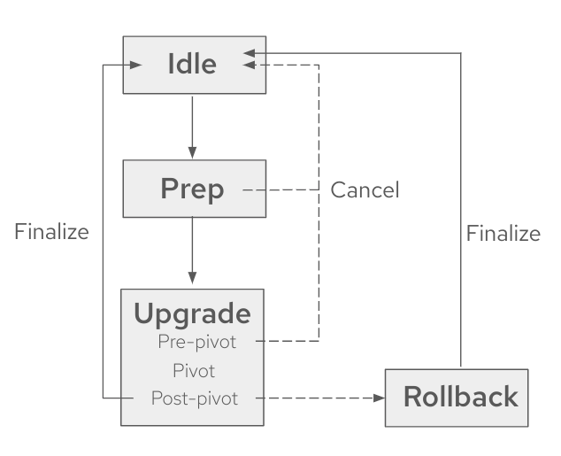
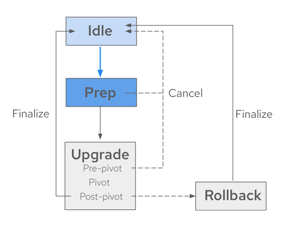
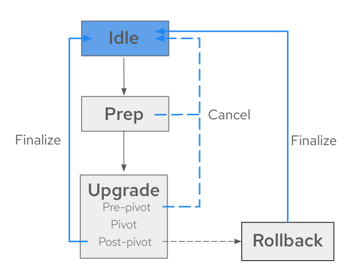
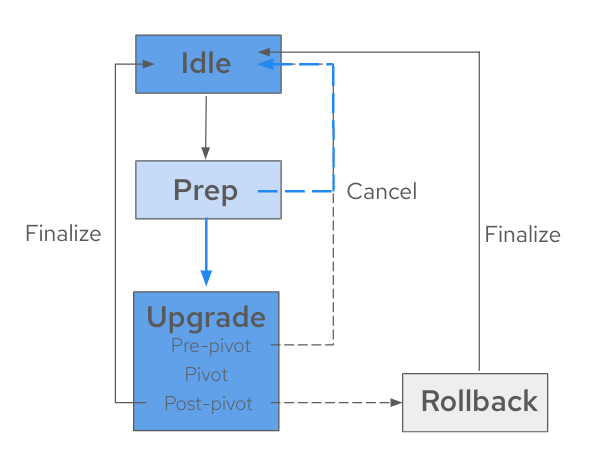
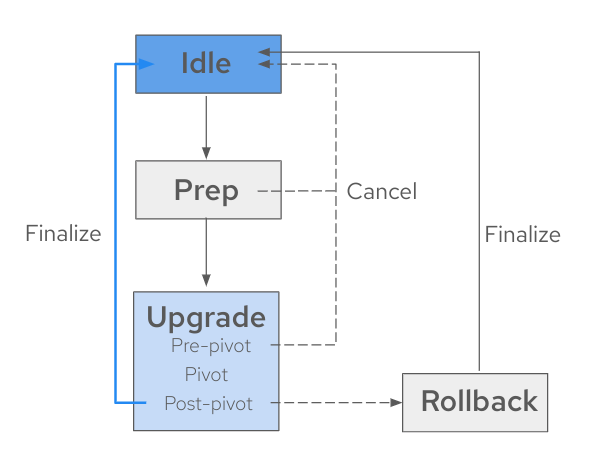
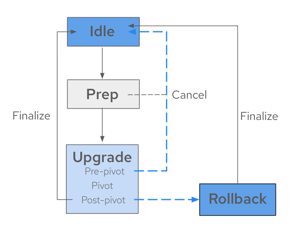
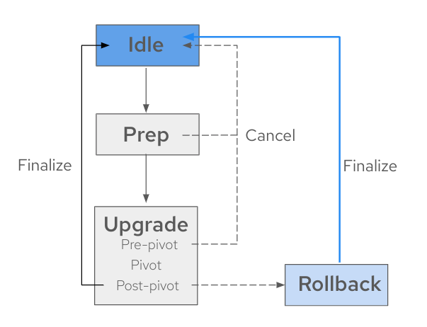

// Module included in the following assemblies:
// * scalability_and_performance/ztp-image-based-upgrade.adoc

:_mod-docs-content-type: CONCEPT
[id="ztp-image-based-upgrade-concept-stages_{context}"]
= Stages of the image-based upgrade

After generating the seed image on the seed cluster, you can move through the stages on the target cluster by setting the `spec.stage` field to the following values in the `ImageBasedUpgrade` CR:

* `Idle`
* `Prep`
* `Upgrade`
* `Rollback` (Optional)

[id="ztp-image-based-upgrade-concept-idle_{context}"]
== Idle stage

The {lcao} creates an `ImageBasedUpgrade` CR set to `stage: Idle` when the Operator is first deployed.
This is the default stage, there is no ongoing upgrade and the cluster is ready to move to the `Prep` stage.

You also move to the `Idle` stage to do one of the following steps:

* Finalize a successful upgrade
* Finalize a rollback
* Cancel an ongoing upgrade until the pre-pivot phase in the `Upgrade` stage

Moving to the `Idle` stage ensures that the {lcao} cleans up resources, so the cluster is ready for upgrades again.

[WARNING]
====
If you move to the `Idle` stage after a rollback, the {lcao} cleans up resources that can be used to troubleshoot a failed upgrade.
====

[id="ztp-image-based-upgrade-concept-prep_{context}"]
== Prep stage

[NOTE]
====
You can complete this stage before a scheduled maintenance window.
====

During the `Prep` stage, you specify the following upgrade details in the `ImageBasedUpgrade` CR:

* seed image to use
* resources to back up
* extra manifests to apply after the upgrade, if any
* custom catalog sources to retain after the upgrade, if any

Then, based on what you specify, the {lcao} prepares for the upgrade without impacting the current running version.
During this stage, the {lcao} ensures that the target cluster is ready to proceed to the `Upgrade` stage by checking if it meets certain conditions and pulls the seed image to the target cluster with additional container images specified in the seed image.

You also prepare backup resources with the OADP Operator's `Backup` and `Restore` CRs.
These CRs are used in the `Upgrade` stage to reconfigure the cluster, register the cluster with {rh-rhacm}, and restore application artifacts.

Additionally to the OADP Operator, the {lcao} uses the `ostree` versioning system to create a backup, which allows complete cluster reconfiguration after both upgrade and rollback.

You can cancel the upgrade process at this point by moving to the `Idle` stage or you can start the upgrade by moving to the `Upgrade` stage in the `ImageBasedUpgrade` CR.
If you stop, the Operator performs cleanup operations.

[id="ztp-image-based-upgrade-concept-upgrade_{context}"]
== Upgrade stage

The `Upgrade` stage consists of three phases:

pre-pivot:: Just before pivoting to the new stateroot, the {lcao} collects the required cluster specific artifacts and stores them in the new stateroot. The backup of your cluster resources specified in the `Prep` stage are created on a compatible Object storage solution. The {lcao} exports CRs specified in the `extraManifests` field in the `ImageBasedUpgrade` CR or the CRs described in the ZTP policies that are bound to the target cluster. Once pre-pivot phase is completed, the {lcao} sets the new stateroot deployment as the default boot entry and reboots the node.
post-pivot:: After booting from the new stateroot, the {lcao} reconfigures the cluster by applying cluster-specific artifacts that were collected in the pre-pivot phase. The Operator applies all saved CRs, and restores the backups.
The Operator also regenerates the seed image's cluster cryptography.
This ensures that each {sno} cluster upgraded with the same seed image has unique and valid cryptographic objects.

Once the upgrade is complete and you are satisfied with the changes, you can finalize the upgrade by moving to the `Idle` stage.

[IMPORTANT]
====
When you finalize the upgrade, you cannot roll back to the original release.
====

If you want to cancel the upgrade, you can do so until the pre-pivot phase of the `Upgrade` stage.
If you encounter issues after the upgrade, you can move to the `Rollback` stage for a manual rollback.

[id="ztp-image-based-upgrade-concept-rollback_{context}"]
== (Optional) Rollback stage

The rollback stage can be initiated manually or automatically upon failure.
During the `Rollback` stage, the {lcao} sets the original `ostree` stateroot deployment as default.
Then, the node reboots with the previous release of {product-title} and application configurations.

The {lcao} initiates an automatic rollback if the upgrade does not complete within a specified time limit.
For more information about the automatic rollback, see the relevant _(Optional) Initiating a rollback with Lifecycle Agent_ sections.

