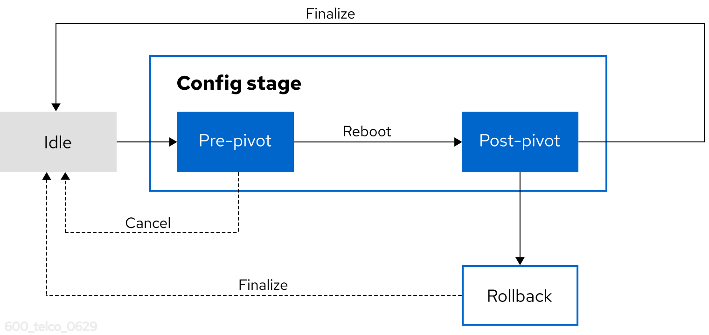

// Module included in the following assemblies:
//
// * edge_computing/sno_ip_configuration/cnf-understanding-sno-ip-configuration.adoc

:_mod-docs-content-type: CONCEPT
[id="cnf-sno-ip-configuration-overview_{context}"]
= Workflow for {sno} network reconfiguration

[role="_abstract"]
The {lcao} uses a stage-driven workflow controlled through the `spec.stage` field in the `IPConfig` CR. The workflow consists of three stages.

.{sno} network reconfiguration stages

Idle stage::
The initial and final stage. In this stage, the {lcao} runs health checks, performs cleanup operations, and prepares the cluster for configuration changes. Transitioning to Idle after a successful configuration is the finalization point that removes rollback capability.

Config stage::
Executes the network reconfiguration in two phases. The pre-pivot phase prepares a new stateroot, which is a bootable system state that has the updated network configuration, and reboots into it. The post-pivot phase applies the network changes, regenerates certificates, and waits for cluster stabilization.

Rollback stage::
Reboots into the earlier stateroot. You can trigger a rollback manually or configure automatic rollback on failure.
+
The network reconfiguration flow preserves the currently booted stateroot as a rollback target while preparing the new configuration in a new stateroot. This approach means the original configuration remains available for rollback until you finalize the change, only one reboot is required for the IP change, and the rollback process is fast because the earlier stateroot is already prepared.
