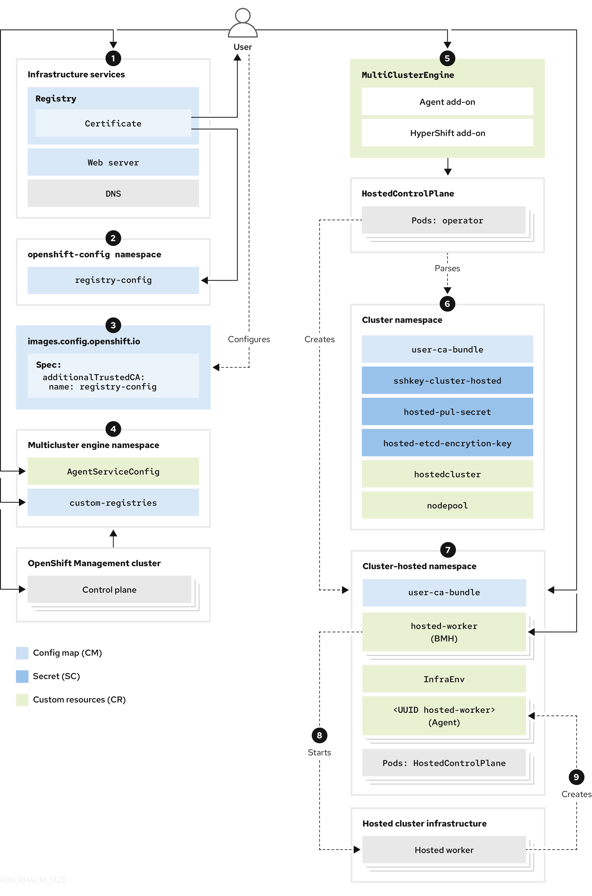

// Module included in the following assemblies:
//
// * hosted_control_planes/hcp-disconnected/hcp-deploy-dc-bm.adoc

:_mod-docs-content-type: CONCEPT
[id="hcp-dc-bm-arch_{context}"]
= Disconnected environment architecture for bare metal

The following diagram illustrates an example architecture of a disconnected environment:

. Configure infrastructure services, including the registry certificate deployment with TLS support, web server, and DNS, to ensure that the disconnected deployment works.
. Create a config map in the `openshift-config` namespace. In this example, the config map is named `registry-config`. The content of the config map is the Registry CA certificate. The data field of the config map must contain the following key/value:

* Key: `<registry_dns_domain_name>..<port>`, for example, `registry.hypershiftdomain.lab..5000:`. Ensure that you place `..` after the registry DNS domain name when you specify a port.
* Value: The certificate content
+
For more information about creating a config map, see _Configuring TLS certificates for a disconnected installation of {hcp}_.
. Modify the `images.config.openshift.io` custom resource (CR) specification and adds a new field named `additionalTrustedCA` with a value of `name: registry-config`.
. Create a config map that contains two data fields. One field contains the `registries.conf` file in `RAW` format, and the other field contains the Registry CA and is named `ca-bundle.crt`. The config map belongs to the `multicluster-engine` namespace, and the config map name is referenced in other objects. For an example of a config map, see the following sample configuration:
+
[source,yaml]
----
apiVersion: v1
kind: ConfigMap
metadata:
  name: custom-registries
  namespace: multicluster-engine
  labels:
    app: assisted-service
data:
  ca-bundle.crt: |
    -----BEGIN CERTIFICATE-----
    # ...
    -----END CERTIFICATE-----
  registries.conf: |
    unqualified-search-registries = ["registry.access.redhat.com", "docker.io"]

    [[registry]]
    prefix = ""
    location = "registry.redhat.io/openshift4"
    mirror-by-digest-only = true

    [[registry.mirror]]
      location = "registry.ocp-edge-cluster-0.qe.lab.redhat.com:5000/openshift4"

    [[registry]]
    prefix = ""
    location = "registry.redhat.io/rhacm2"
    mirror-by-digest-only = true
# ...
# ...
----

. In the {mce-short} namespace, you create the `multiclusterengine` CR, which enables both the Agent and `hypershift-addon` add-ons. The {mce-short} namespace must contain the config maps to modify behavior in a disconnected deployment. The namespace also contains the `multicluster-engine`, `assisted-service`, and `hypershift-addon-manager` pods.
. Create the following objects that are necessary to deploy the hosted cluster:

** Secrets: Secrets contain the pull secret, SSH key, and etcd encryption key.
** Config map: The config map contains the CA certificate of the private registry.
** `HostedCluster`: The `HostedCluster` resource defines the configuration of the cluster that the user intends to create.
** `NodePool`: The `NodePool` resource identifies the node pool that references the machines to use for the data plane.

. After you create the hosted cluster objects, the HyperShift Operator establishes the `HostedControlPlane` namespace to accommodate control plane pods. The namespace also hosts components such as Agents, bare metal hosts (BMHs), and the `InfraEnv` resource. Later, you create the `InfraEnv` resource, and after ISO creation, you create the BMHs and their secrets that contain baseboard management controller (BMC) credentials.

. The Metal3 Operator in the `openshift-machine-api` namespace inspects the new BMHs. Then, the Metal3 Operator tries to connect to the BMCs to start them by using the configured `LiveISO` and `RootFS` values that are specified through the `AgentServiceConfig` CR in the {mce-short} namespace.

. After the worker nodes of the `HostedCluster` resource are started, an Agent container is started. This agent establishes contact with the Assisted Service, which orchestrates the actions to complete the deployment. Initially, you need to scale the `NodePool` resource to the number of worker nodes for the `HostedCluster` resource. The Assisted Service manages the remaining tasks.

. At this point, you wait for the deployment process to be completed.