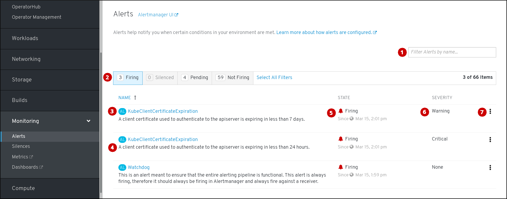

// Module included in the following assemblies:
//
// monitoring/configuring-monitoring-stack.adoc

[id='contents-of-alertmanager-ui-{context}']
= Contents of Alertmanager UI

This section shows and explains the contents of the Alertmanager UI.

The main two screens of the UI are the "Alerts" and the "Silences" screens.

The "Alerts" screen is located in "Monitoring" -> "Alerts" of the {product-title} 4 Console.

<1> Filtering alerts by their name.
<2> Filtering the alerts by their state. To fire, some alerts need a certain condition to be true for the duration of a timeout. If a condition of an alert is currently true, but the timeout has not been reached, such an alert is in the _Pending_ state.
<3> Alert name.
<4> Description of an alert.
<5> Current state of the alert and when the alert went into this state.
<6> Value of the Severity label of the alert.
<7> Actions you can do with the alert.

The "Silences" screen is located in "Monitoring" -> "Silences" of the {product-title} 4 Console.

<1> Creating a silence for an alert.
<2> Filtering silences by their name.
<3> Filtering silences by their state. If a silence is pending, it is currently not active, because it is scheduled to start at a later time.
<4> Description of a silence. It includes the specification of alerts that it matches.
<5> Current state of the silence. For active silences, it shows when it ends, and for pending silences, it shows when it starts.
<6> Number of alerts that are being silenced by the silence.
<7> Actions you can do with a silence.
