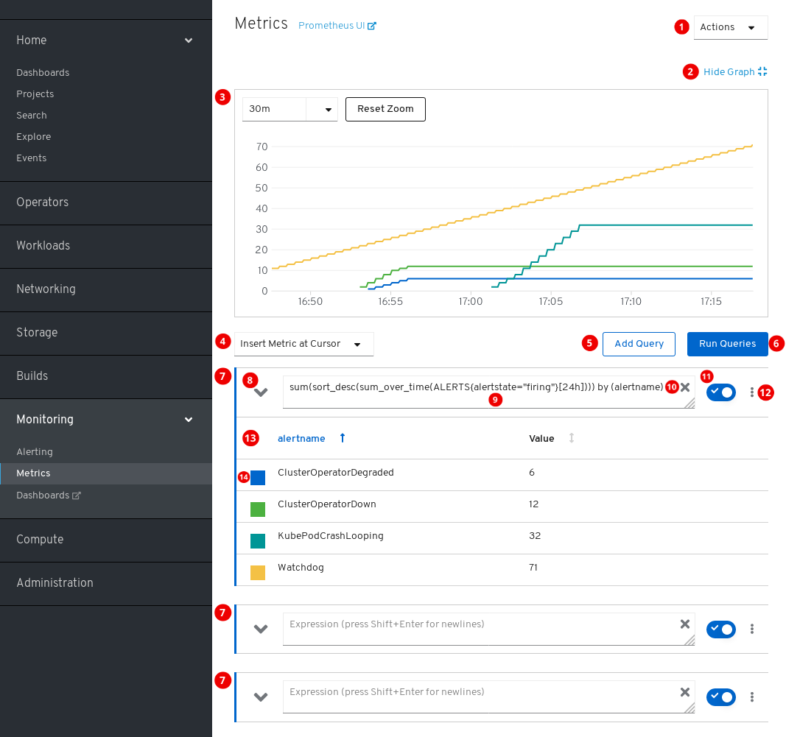

// Module included in the following assemblies:
//
// * monitoring/cluster-monitoring/examining-cluster-metrics.adoc

[id="contents-of-the-metrics-ui_{context}"]
= Contents of the Metrics UI

This section shows and explains the contents of the Metrics UI, a Web interface to Prometheus.

The *Metrics* page is located in *Monitoring* -> *Metrics* of the {product-title} web console.

. Actions.
* Add query.
* Expand all query tables.
* Delete all queries.
. Hide the plot.
. The interactive plot.
. The catalog of available metrics.
. Add query.
. Run queries.
. Query forms.
. Expand or collapse the form.
. The query.
. Clear query.
. Disable query.
. Actions for a specific query.
* Disable query.
* Hide all series of the query from the plot.
* Delete query.
. The metrics table for a query.
. Color assigned to the graph of the metric. Clicking the square shows or hides the metric's graph.

Additionally, there is a link to the old Prometheus interface next to the title of the page.
