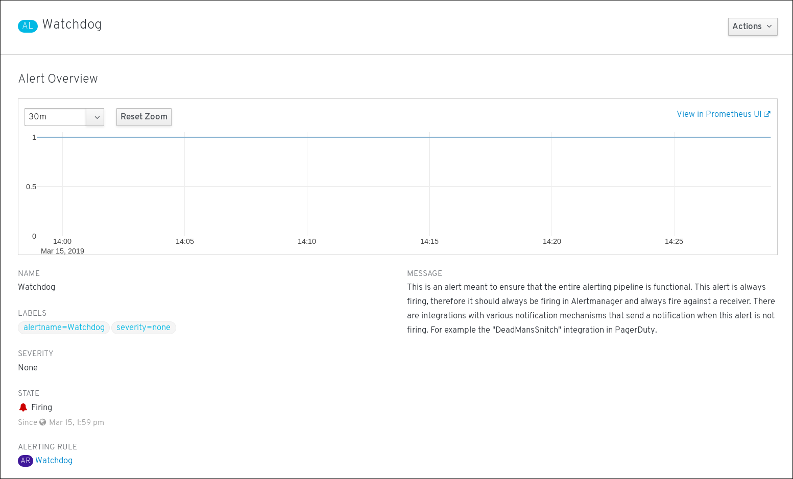
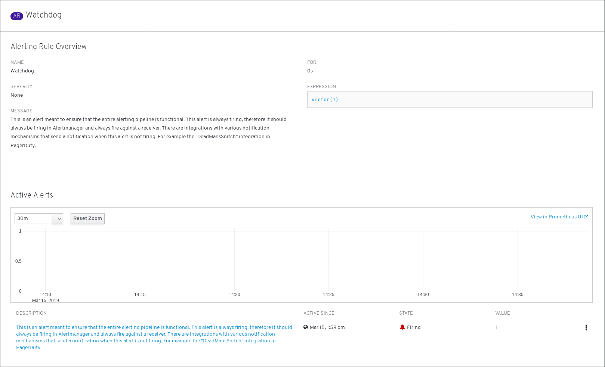

// Module included in the following assemblies:
//
// monitoring/configuring-monitoring-stack.adoc

[id='getting-information-about-alerts-and-alerting-rules-{context}']
= Getting information about alerts and alerting rules

This procedure shows how to find an alert and see information about it or its governing alerting rule.

.Procedure

. Open the {product-title} 4 Console and navigate to "Monitoring" -> "Alerts".

. (optional) Filter the alerts by name using the "Filter alerts by name" field.

. (optional) Filter the alerts by state using one or more of the state buttons "Firing", "Silenced", "Pending", "Not firing".

. (optional) Sort the alerts by clicking one or more of the "Name", "State", and "Severity" column headers.

. Once you see your wanted alert, you can see either details of the alert or details of its governing alerting rule.
+
To see alert details, click on the name of the alert. This is the screen with alert details:
+

+
The screen has the graph with timeseries of the alert. It also has information about the alert, including:
+
--
* a link to its governing alerting rule
* description of the alert
--
+
To see alerting rule details, click on the action button and select "View Alerting Rule". This is the screen with alerting rule details:
+

+
The screen has information about the alerting rule, including:
+
* alerting rule name, severity, and description
* the expression that defines the condition for firing the alert
* the time for which the condition should be true for an alert to fire
* graph for each alert governed by the alerting rule, showing the value with which the alert is firing
* table of all alerts governed by the alerting rule
