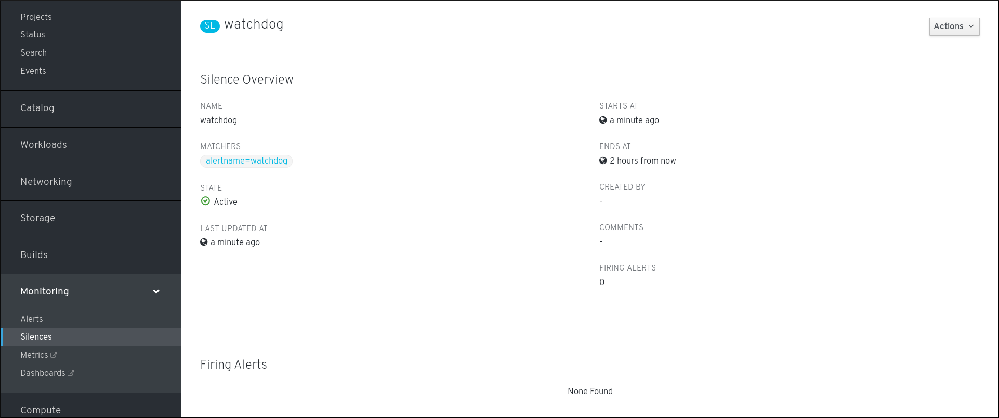

// Module included in the following assemblies:
//
// monitoring/configuring-monitoring-stack.adoc

[id='getting-information-about-silences-{context}']
= Getting information about silences

This procedure shows how to find a silence and see information about it.

.Procedure

. Open the {product-title} 4 Console and navigate to "Monitoring" -> "Silences".

. (optional) Filter the silences by name using the "Filter Silences by name" field.

. (optional) Filter the silences by state using one or more of the state buttons "Active", "Pending", "Expired".

. (optional) Sort the silences by clicking one or more of the "Name", "State", and "Firing alerts" column headers.

. Once you see your wanted silence, you can click its name to see the details:
+

