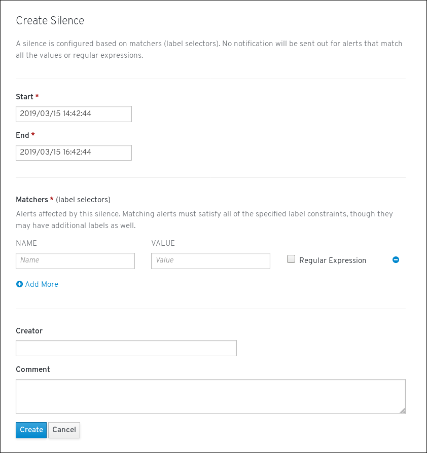

// Module included in the following assemblies:
//
// monitoring/configuring-monitoring-stack.adoc

[id='monitoring-silencing-alerts-{context}']
= Silencing alerts

You can silence alerts. There are two ways to do it:

* silence a set of alerts that match the specification you write from scratch
* silence a specific alert

.Procedure

To silence a set of alerts by creating an alert specification from scratch:

. Navigate to the "Monitoring" -> "Silences" screen of the {product-title} 4 Console.

. Click the "Create Silence" button.

. Populate the "Create Silence" form and click the "Create" button. This creates the silence.

To silence a specific alert:

. Navigate to the "Monitoring" -> "Alerts" screen of the {product-title} 4 Console.

. For the alert that you want to silence, click the action button and click "Silence Alert".

. The "Create Silence" form will appear with prepopulated specification of the chosen alert. You can modify the silence or continue by clicking the "Create" button. This creates the silence.
