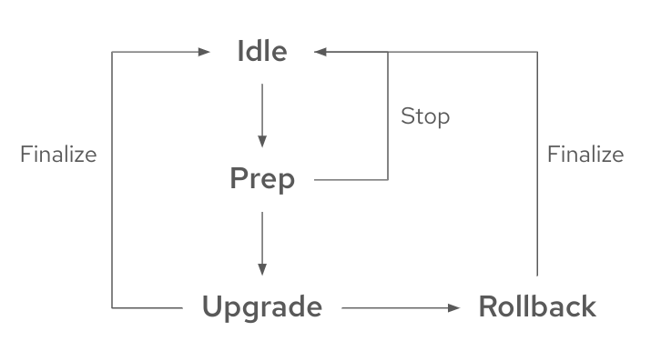

// Module included in the following assemblies:
// * scalability_and_performance/ztp-image-based-upgrade.adoc

:_mod-docs-content-type: CONCEPT
[id="ztp-image-based-upgrade-concept_{context}"]
= Understanding the image-based upgrade for {sno} cluster with the {lcao}

This upgrade method utilizes a generated OCI image from a dedicated seed cluster that is installed on the target {sno} cluster as a new `ostree` stateroot.
A seed cluster is a {sno} cluster deployed with the target {product-title} version, Day 2 Operators, and configurations that is common to all target clusters.

You can use the seed image, which is generated from the seed cluster, to upgrade the platform version on any {sno} cluster that has the same combination of hardware, Day 2 Operators, and cluster configuration as the seed cluster.

[IMPORTANT]
====
The image-based upgrade uses custom images that are specific to the hardware platform that the clusters are running on.
Each different hardware platform requires a separate seed image.
====

The {lcao} uses two custom resources (CRs) on the participating clusters to orchestrate the upgrade:

* On the seed cluster, the `SeedGenerator` CR allows for the seed image generation. This CR specifies the repository to push the seed image to.
* On the target cluster, the `ImageBasedUpgrade` CR specifies the seed container image for the upgrade of the target cluster and the backup configurations for your workloads.

.Example SeedGenerator CR
[source,yaml]
----
apiVersion: lca.openshift.io/v1alpha1
kind: SeedGenerator
metadata:
  name: seedimage
spec:
  seedImage: <seed_container_image>
----

.Example ImageBasedUpgrade CR
[source,yaml]
----
apiVersion: lca.openshift.io/v1alpha1
kind: ImageBasedUpgrade
metadata:
  name: example-upgrade
spec:
  stage: Idle <1>
  seedImageRef: <2>
    version: <target_version>
    image: <seed_container_image>
    pullSecretRef: <seed_pull_secret>
  autoRollbackOnFailure: {}
#    initMonitorTimeoutSeconds: 1800 <3>
  extraManifests: <4>
  - name: example-extra-manifests
    namespace: openshift-lifecycle-agent
  oadpContent: <5>
  - name: oadp-cm-example
    namespace: openshift-adp
----
<1> Defines the desired stage for the `ImageBasedUpgrade` CR. The value can be `Idle`, `Prep`, `Upgrade`, or `Rollback`.
<2> Defines the target platform version, the seed image to be used, and the secret required to access the image.
<3> (Optional) Specify the time frame in seconds to roll back when the upgrade does not complete within that time frame after the first reboot. If not defined or set to `0`, the default value of `1800` seconds (30 minutes) is used.
<4> (Optional) Specify the list of `ConfigMap` resources that contain the additional manifests that you want to apply to the target cluster. You can also add your custom catalog sources that you want to retain after the upgrade.
<5> Specify the list of `ConfigMap` resources that contain the OADP `Backup` and `Restore` CRs.

[id="ztp-image-based-upgrade-concept-stages_{context}"]
== Stages

After generating the seed image on the seed cluster, you can move through the stages on the target cluster by setting the `spec.stage` field to the following values in the `ImageBasedUpgrade` CR:

* `Idle`
* `Prep`
* `Upgrade`
* `Rollback` (Optional)

[id="ztp-image-based-upgrade-concept-idle_{context}"]
=== Idle stage

The {lcao} creates an `ImageBasedUpgrade` CR set to `stage: Idle` when the Operator is first deployed.
This is the default stage.
There is no ongoing upgrade and the cluster is ready to move to the `Prep` stage.

After a successful upgrade or a rollback, you commit to the change by patching the `stage` field to `Idle` in the `ImageBasedUpgrade` CR.
Changing to this stage ensures that the {lcao} cleans up resources, so the cluster is ready for upgrades again.

[id="ztp-image-based-upgrade-concept-prep_{context}"]
=== Prep stage

[NOTE]
====
You can complete this stage before a scheduled maintenance window.
====

During the `Prep` stage, you specify the following upgrade details in the `ImageBasedUpgrade` CR:

* seed image to use
* resources to back up
* extra manifests to apply after the upgarde upgrade, if any
* custom catalog sources to retain after the upgrade, if any

Then, based on what you specify, the {lcao} prepares for the upgrade without impacting the current running version.
During this stage, the {lcao} ensures that the target cluster is ready to proceed to the `Upgrade` stage by checking if it meets certain conditions and pulls the seed image to the target cluster with additional container images specified in the seed image.

You also prepare backup resources with the OADP Operator's `Backup` and `Restore` CRs.
These CRs are used in the `Upgrade` stage to reconfigure the cluster, register the cluster with {rh-rhacm}, and restore application artifacts.

Additionally to the OADP Operator, the {lcao} uses the `ostree` versioning system to create a backup, which allows complete cluster reconfiguration after both upgrade and rollback.

[IMPORTANT]
====
The same version of the applications must function on both the current and the target release of {product-title}.
====

You can stop the upgrade process at this point by moving to the `Idle` stage or you can start the upgrade by moving to the `Upgrade` stage in the `ImageBasedUpgrade` CR .
If you stop, the Operator performs cleanup operations.

[id="ztp-image-based-upgrade-concept-upgrade_{context}"]
=== Upgrade stage

The `Upgrade` stage consists of three phases:

pre-pivot:: Just before pivoting to the new stateroot, the {lcao} collects the required cluster specific artifacts and stores them in the new stateroot. The backup of your cluster resources specified in the `Prep` stage are created on a compatible Object storage solution. The {lcao} exports CRs specified in the `extraManifests` field in the `ImageBasedUpgrade` CR or the CRs described in the ZTP policies that are bound to the target cluster.
pivot:: Once pre-pivot phase is completed, the {lcao} makes the new state root as default and reboots the node.
post-pivot:: After booting from the new stateroot, the {lcao} reconfigures the cluster by applying cluster-specific artifacts that were collected in the pre-pivot phase. The Operator applies all saved CRs, and restores the backups.
The Operator also regenerates the seed image's cluster cryptography.
This ensures that each {sno} cluster upgraded with the same seed image has unique and valid cryptographic objects.

Once you are satisfied with the changes, you can finalize the upgrade by moving to the `Idle` stage.
If you encounter issues after the upgrade, you can move to the `Rollback` stage for a manual rollback.

[id="ztp-image-based-upgrade-concept-rollback_{context}"]
=== (Optional) Rollback stage

The rollback stage can be initiated manually or automatically upon failure.
During the `Rollback` stage, the {lcao} sets the original `ostree` stateroot as default.
Then, the node reboots with the previous release of {product-title} and application configurations.

The {lcao} initiates an automatic rollback if the upgrade does not complete within a specified time limit.
For more information about the automatic rollback, see the relevant _(Optional) Initiating a rollback with Lifecycle Agent_ sections.

[WARNING]
====
If you move to the `Idle` stage after a rollback, the {lcao} cleans up resources that can be used to troubleshoot a failed upgrade.
====