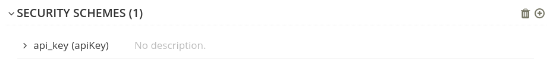
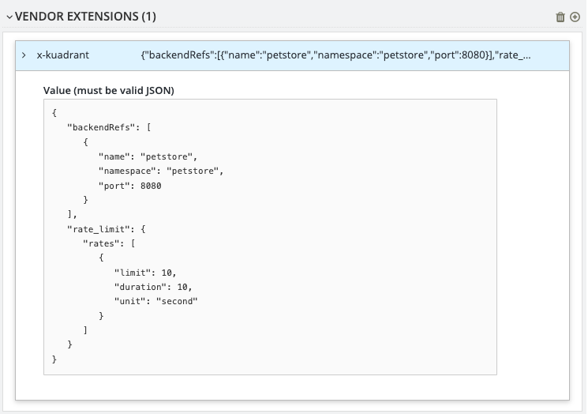

# Using Apicurio Studio with Kuadrant OAS extensions

You can use [OpenAPI extensions](https://swagger.io/docs/specification/openapi-extensions/) to define extra functionality beyond what is covered by the standard OpenAPI specification. Extensions typically start with the `x-` prefix, for example, `x-codegen`. Kuadrant OpenAPI extensions start with the `x-kuadrant` prefix, and allow you to configure Kuadrant policy information alongside your API.

[Apicurio Studio](https://www.apicur.io/studio) is a UI tool for visualizing and editing OpenAPI designs and definitions, which can visualize security details and custom extensions specified in your OpenAPI definition.

## Prerequisites

- You have Apicurio Studio installed and running. For more information, see the [Apicurio Studio documentation](https://www.apicur.io/studio/docs). 

## Procedure 

### Step 1 - Access your OpenAPI definition in Apicurio Studio

Open or import your OpenAPI definition in Apicurio Studio. On the **Design** tab, select the **VENDOR-EXTENSiONS** section to add an extension. Alternatively, you can use the **Source** tab to edit the API definition directly.

### Step 2 - Add Kuadrant extensions to your API definition

The following configuration and extension points are supported by Apicurio Studio and the `kuadrantctl` CLI:

#### Generate an HTTP route

To generate an [HTTPRoute](https://gateway-api.sigs.k8s.io/api-types/httproute/) for the API, add the following `x-kuadrant` block to your API definition in Apicurio Studio, replacing values to match your API details and the location of your Gateway:

```yaml
x-kuadrant:
    route:
        name: petstore
        namespace: petstore
        hostnames:
            - 'petstore.example.com'
        parentRefs:
            -   name: prod-web
                namespace: kuadrant-multi-cluster-gateways
                kind: Gateway
```

For more details, see [Generate Gateway API HTTPRoute object from OpenAPI 3](./generate-gateway-api-httproute.md).

#### Generate an AuthPolicy

To generate an [AuthPolicy](https://docs.kuadrant.io/kuadrant-operator/doc/auth/), add a `securityScheme` to the `components` block in your API definition. The following `securityScheme` requires that an API key header is set:

```yaml
    securitySchemes:
        api_key:
            type: apiKey
            name: api_key
            in: header
```

Although `securityScheme` is not an OpenAPI extension, it is used by `kuadrantctl` like the other extensions mentioned in this document.

When added, Apicurio Studio will display the following update in the **SECURITY SCHEMES** section:



For more details, see [Generate Kuadrant AuthPolicy object from OpenAPI 3](./generate-kuadrant-auth-policy.md).

#### Generate a RateLimitPolicy

To generate a [RateLimitPolicy](https://docs.kuadrant.io/kuadrant-operator/doc/rate-limiting/) for the API, add the following `x-kuadrant` block to a path in your API definition, replacing values to match your API details.

```yaml
paths:
    /:
        x-kuadrant:
            backendRefs:
                -
                    name: petstore
                    namespace: petstore
                    port: 8080
            rate_limit:
                rates:
                    -
                        limit: 10
                        duration: 10
                        unit: second
```

When added, Apicurio Studio  will display the following update in the **VENDOR-EXTENSiONS** section for that specific path:



For more details, see [Generate Kuadrant RateLimitPolicy object from OpenAPI 3](./generate-kuadrant-rate-limit-policy.md).

## Additional resources

- [OpenAPI 3.0.x Kuadrant Extensions in the kuadrantctl documentation](./openapi-kuadrant-extensions.md).
- [Apicurio Studio - Now with OpenAPI Vendor Extensions](https://www.apicur.io/blog/2024/05/10/studio-vendor-extensions). 


